# Iris Classifier — демонстрация

[Описание проекта](README.md) · [Каталог лабораторных](../README.md) · [Результаты проверок](../docs/validation.md)

**14 скриншотов и два видеообзора** показывают отдельные свойства реализации. Каждый снимок сопровождается исходными данными; снимок общего pipeline используется в обеих галереях.

API, тесты и сборка индекса записаны при локальном выполнении. Состояние учебного Kubernetes, promotion и rollback взяты из артефактов [успешного pipeline](https://github.com/Ingaleee/itmo-mlops/actions/runs/37905104404). Эти сохранённые результаты не являются мониторингом текущего состояния стенда.

Скриншоты сняты в браузере: интерфейсы OpenAPI и GitHub показаны напрямую, остальные результаты — в [просмотрщике](../docs/media/index.html). Видео составлены из последовательности экранов просмотрщика; анимация в Markdown служит предпросмотром MP4. Все отображаемые ответы и метрики получены из реальных запусков.

## Видео

### API: readiness, три класса и валидация

[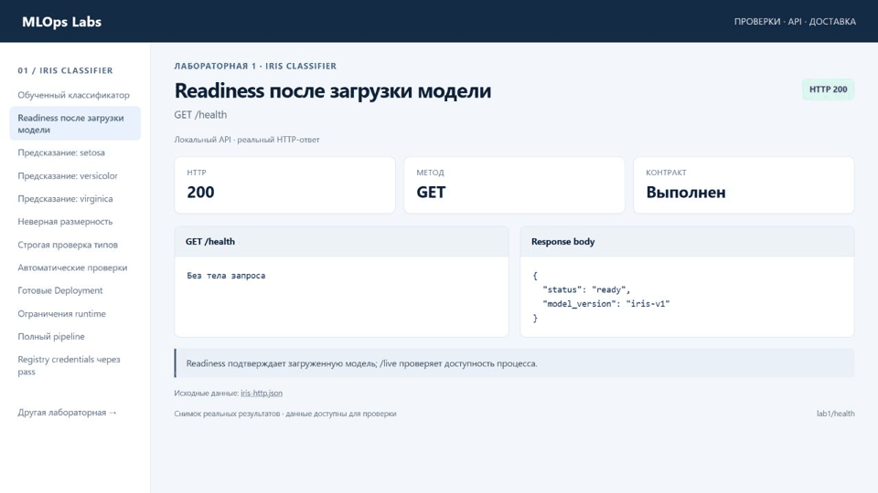](../docs/media/lab1/api-demo.mp4)

[Скачать MP4](../docs/media/lab1/api-demo.mp4) · 30 секунд · без звука

### Доставка: обучение, тесты, CI, Kubernetes и registry

[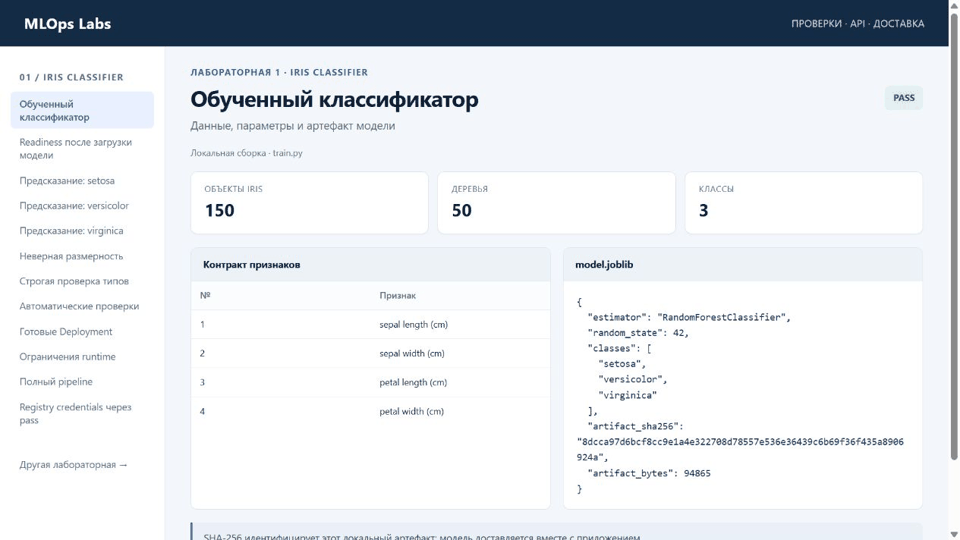](../docs/media/lab1/delivery-demo.mp4)

[Скачать MP4](../docs/media/lab1/delivery-demo.mp4) · 30 секунд · без звука

## Скриншоты

Изображения открываются в полном разрешении. JSON-источники содержат запросы, ответы, вывод команд или сохранённые параметры выпуска.

### OpenAPI — интерфейс работающего сервиса

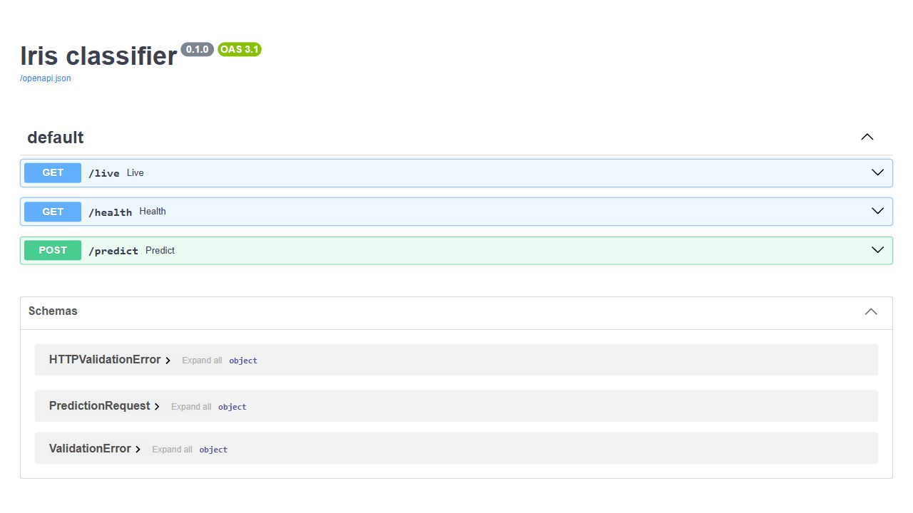

Настоящий Swagger UI локального сервиса. [Сохранённая схема API](../docs/media/sources/iris-openapi.json) описывает endpoints и ограничения запросов.

### GitHub Actions — успешный полный workflow

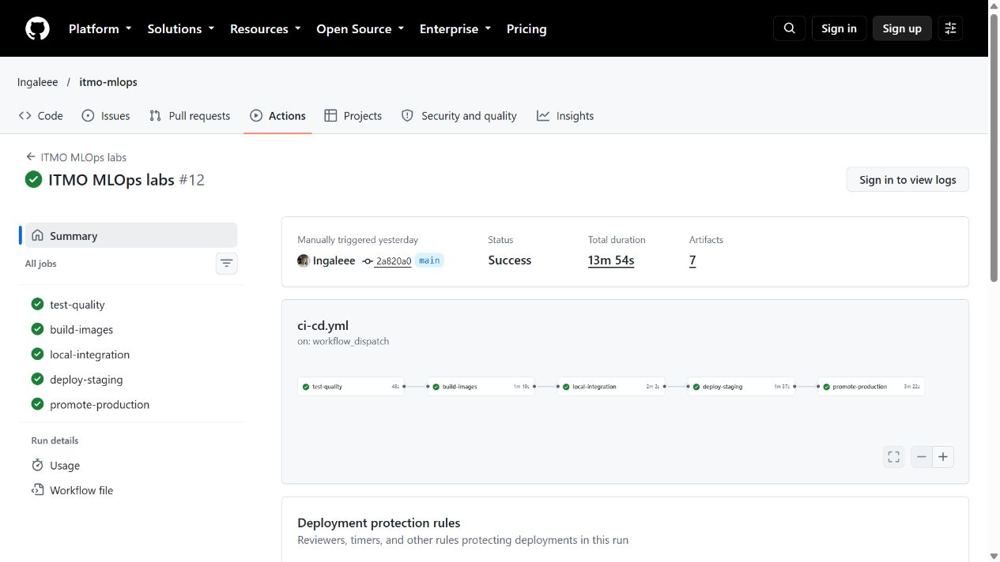

Все пять jobs завершены, включая deploy-staging и promote-production. [Открыть запуск](https://github.com/Ingaleee/itmo-mlops/actions/runs/37905104404) · [Данные GitHub API](../docs/media/sources/teaching-pipeline.json).

### 1. Обученный классификатор

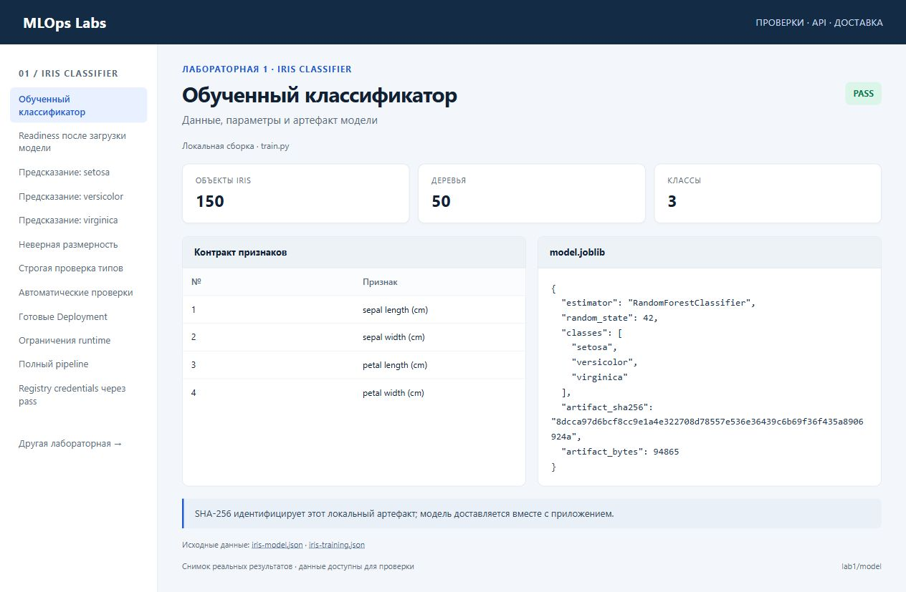

SHA-256 идентифицирует этот локальный артефакт; модель доставляется вместе с приложением.

Источник: [iris-model.json](../docs/media/sources/iris-model.json) · [iris-training.json](../docs/media/sources/iris-training.json).

### 2. Readiness после загрузки модели

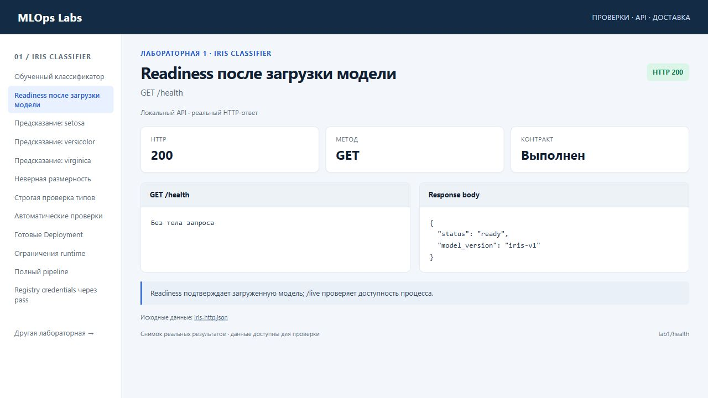

Readiness подтверждает загруженную модель; /live проверяет доступность процесса.

Источник: [iris-http.json](../docs/media/sources/iris-http.json).

### 3. Предсказание: setosa

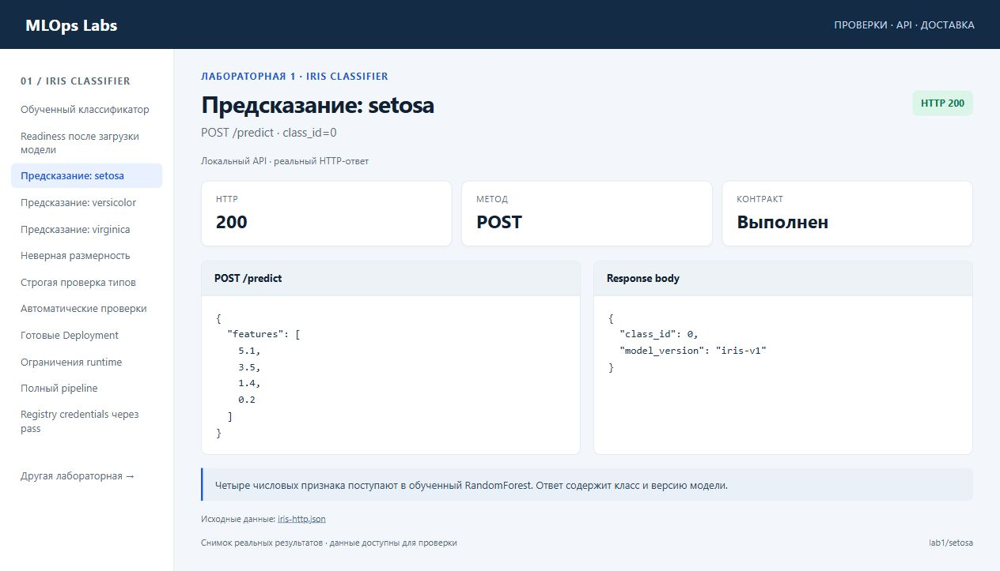

Четыре числовых признака поступают в обученный RandomForest. Ответ содержит класс и версию модели.

Источник: [iris-http.json](../docs/media/sources/iris-http.json).

### 4. Предсказание: versicolor

Четыре числовых признака поступают в обученный RandomForest. Ответ содержит класс и версию модели.

Источник: [iris-http.json](../docs/media/sources/iris-http.json).

### 5. Предсказание: virginica

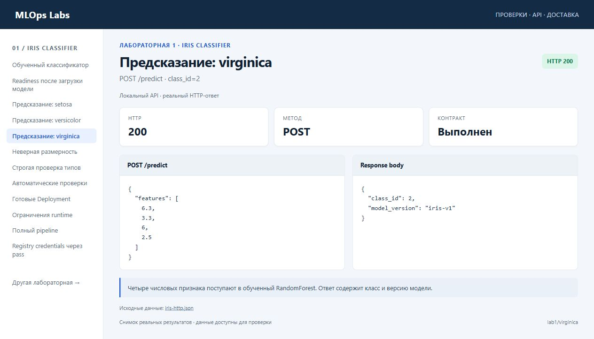

Четыре числовых признака поступают в обученный RandomForest. Ответ содержит класс и версию модели.

Источник: [iris-http.json](../docs/media/sources/iris-http.json).

### 6. Неверная размерность

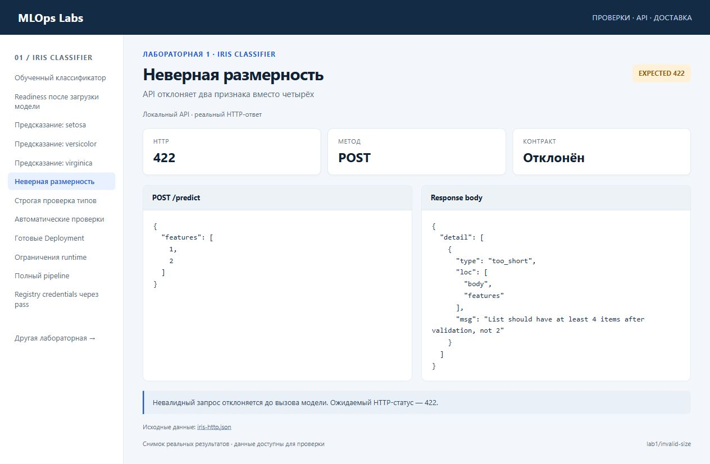

Невалидный запрос отклоняется до вызова модели. Ожидаемый HTTP-статус — 422.

Источник: [iris-http.json](../docs/media/sources/iris-http.json).

### 7. Строгая проверка типов

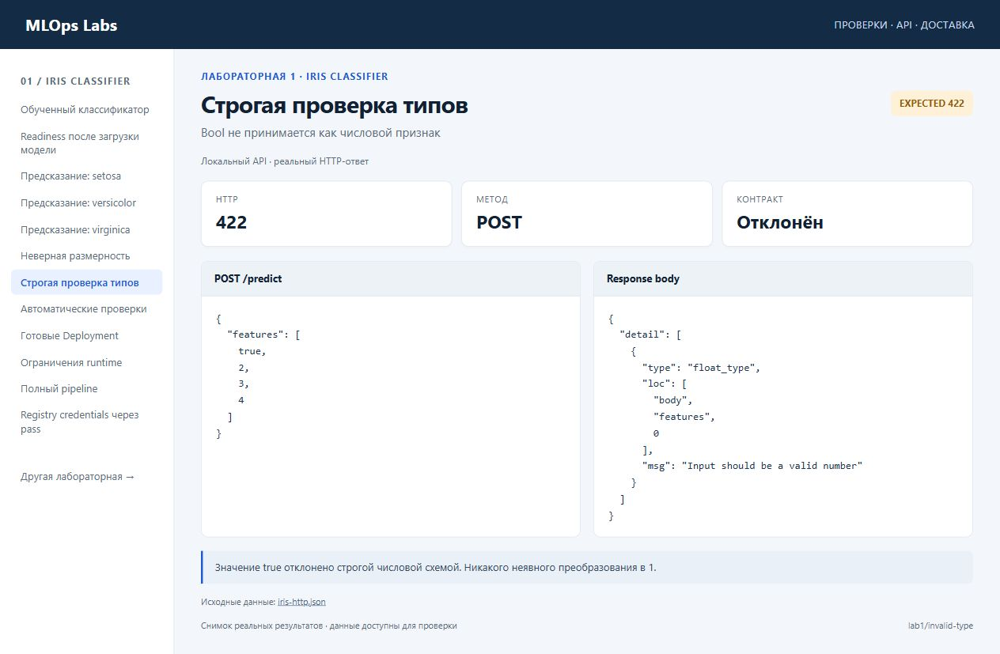

Значение true отклонено строгой числовой схемой. Никакого неявного преобразования в 1.

Источник: [iris-http.json](../docs/media/sources/iris-http.json).

### 8. Автоматические проверки

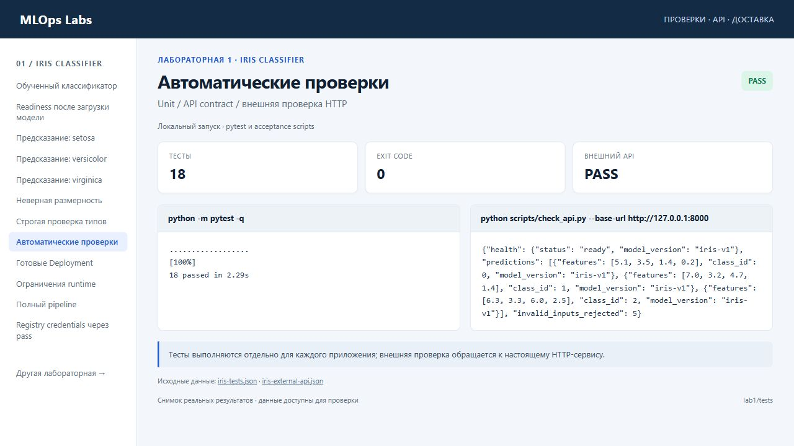

Тесты выполняются отдельно для каждого приложения; внешняя проверка обращается к настоящему HTTP-сервису.

Источник: [iris-tests.json](../docs/media/sources/iris-tests.json) · [iris-external-api.json](../docs/media/sources/iris-external-api.json).

### 9. Готовые Deployment

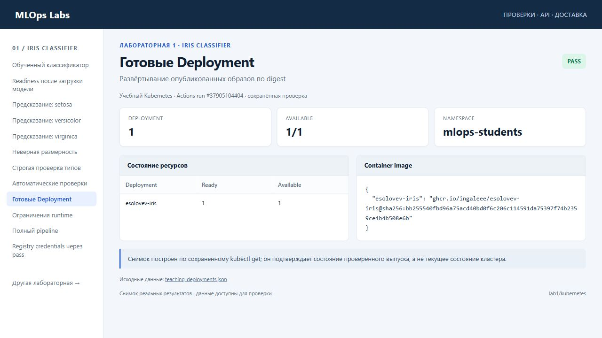

Снимок построен по сохранённому kubectl get; он подтверждает состояние проверенного выпуска, а не текущее состояние кластера.

Источник: [teaching-deployments.json](../docs/media/sources/teaching-deployments.json).

### 10. Ограничения runtime

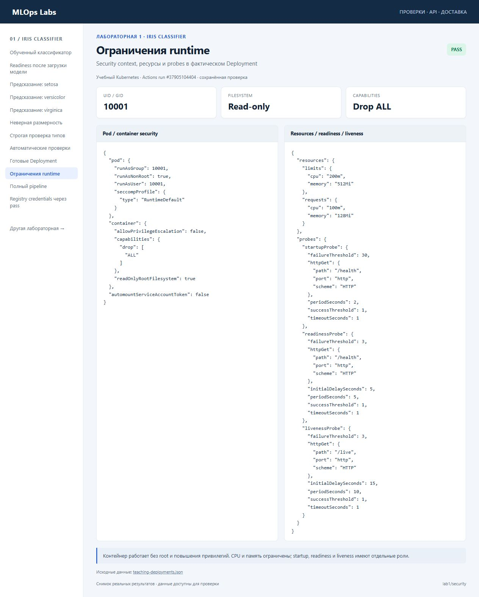

Контейнер работает без root и повышения привилегий. CPU и память ограничены; startup, readiness и liveness имеют отдельные роли.

Источник: [teaching-deployments.json](../docs/media/sources/teaching-deployments.json).

### 11. Полный pipeline

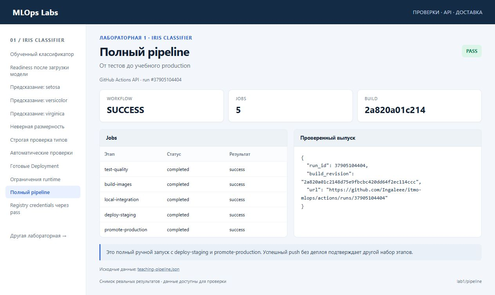

Это полный ручной запуск с deploy-staging и promote-production. Успешный push без деплоя подтверждает другой набор этапов.

Источник: [teaching-pipeline.json](../docs/media/sources/teaching-pipeline.json).

### 12. Registry credentials через pass

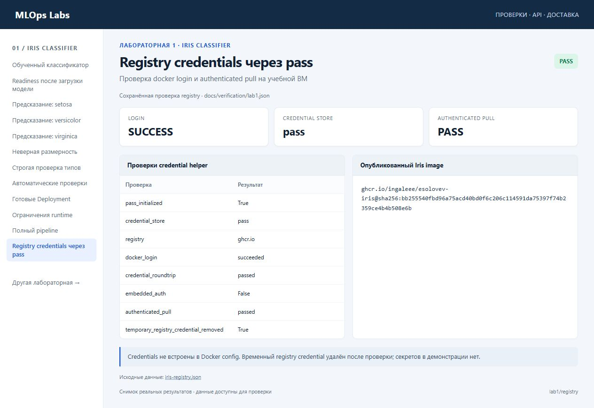

Credentials не встроены в Docker config. Временный registry credential удалён после проверки; секретов в демонстрации нет.

Источник: [iris-registry.json](../docs/media/sources/iris-registry.json).

## Происхождение файлов

[Манифест](../docs/media/manifest.json) перечисляет изображения и видео, их размеры, SHA-256 и источники. Порядок воспроизведения и обновления материалов описан в [инструкции](../docs/media/README.md).
