# Runbook Search — демонстрация

[Описание проекта](README.md) · [Каталог лабораторных](../README.md) · [Результаты проверок](../docs/validation.md)

**18 скриншотов и два видеообзора** показывают отдельные свойства реализации. Каждый снимок сопровождается исходными данными; снимок общего pipeline используется в обеих галереях.

API, тесты и сборка индекса записаны при локальном выполнении. Состояние учебного Kubernetes, promotion и rollback взяты из артефактов [успешного pipeline](https://github.com/Ingaleee/itmo-mlops/actions/runs/37905104404). Эти сохранённые результаты не являются мониторингом текущего состояния стенда.

Скриншоты сняты в браузере: интерфейсы OpenAPI и GitHub показаны напрямую, остальные результаты — в [просмотрщике](../docs/media/index.html). Видео составлены из последовательности экранов просмотрщика; анимация в Markdown служит предпросмотром MP4. Все отображаемые ответы и метрики получены из реальных запусков.

## Видео

### Retrieval: индекс, поиск, рекомендации и метрики

[Скачать MP4](../docs/media/lab2/retrieval-demo.mp4) · 30 секунд · без звука

### Выпуск: quality gate, promotion и rollback

[Скачать MP4](../docs/media/lab2/release-demo.mp4) · 30 секунд · без звука

## Скриншоты

Изображения открываются в полном разрешении. JSON-источники содержат запросы, ответы, вывод команд или сохранённые параметры выпуска.

### OpenAPI — интерфейс работающего сервиса

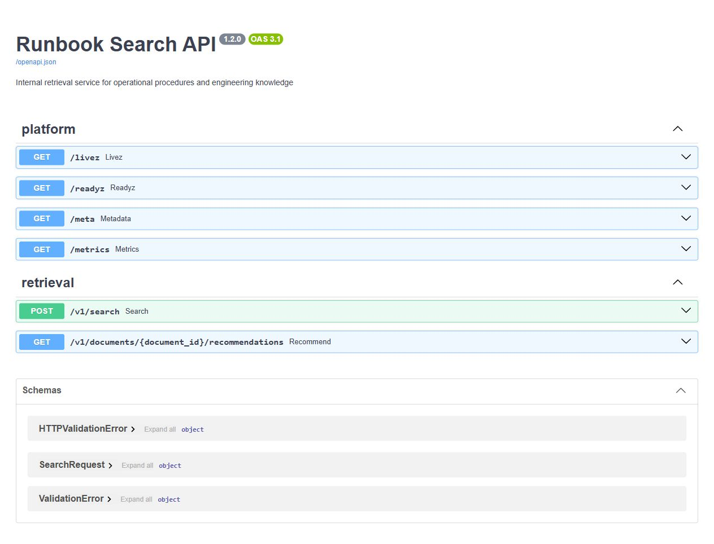

Настоящий Swagger UI локального сервиса. [Сохранённая схема API](../docs/media/sources/search-openapi.json) описывает endpoints и ограничения запросов.

### GitHub Actions — успешный полный workflow

Все пять jobs завершены, включая deploy-staging и promote-production. [Открыть запуск](https://github.com/Ingaleee/itmo-mlops/actions/runs/37905104404) · [Данные GitHub API](../docs/media/sources/teaching-pipeline.json).

### 1. Автоматические проверки

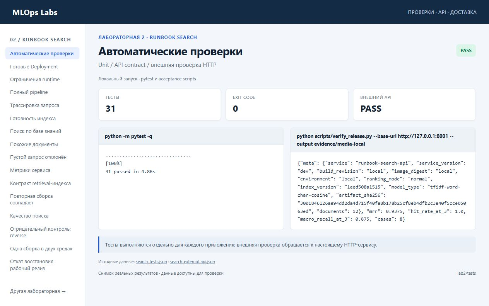

Тесты выполняются отдельно для каждого приложения; внешняя проверка обращается к настоящему HTTP-сервису.

Источник: [search-tests.json](../docs/media/sources/search-tests.json) · [search-external-api.json](../docs/media/sources/search-external-api.json).

### 2. Готовые Deployment

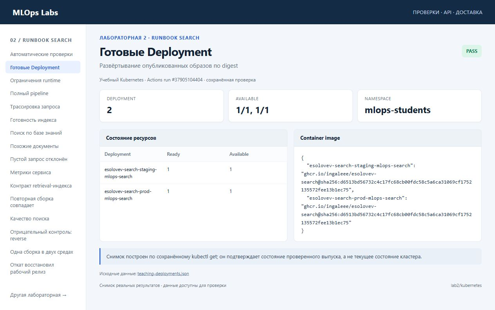

Снимок построен по сохранённому kubectl get; он подтверждает состояние проверенного выпуска, а не текущее состояние кластера.

Источник: [teaching-deployments.json](../docs/media/sources/teaching-deployments.json).

### 3. Ограничения runtime

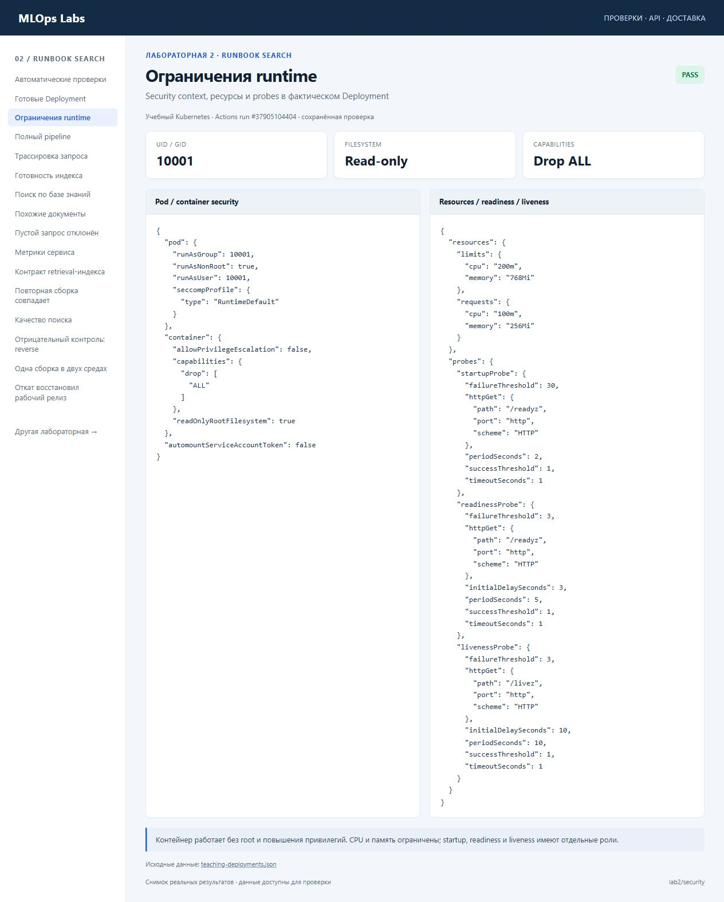

Контейнер работает без root и повышения привилегий. CPU и память ограничены; startup, readiness и liveness имеют отдельные роли.

Источник: [teaching-deployments.json](../docs/media/sources/teaching-deployments.json).

### 4. Полный pipeline

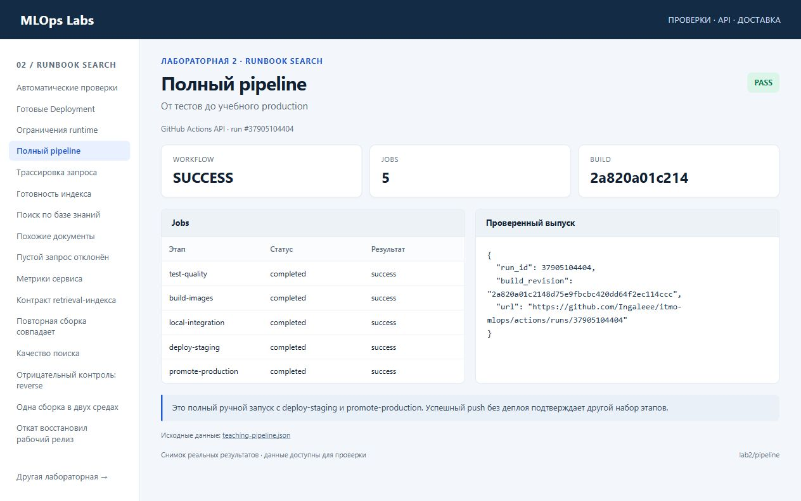

Это полный ручной запуск с deploy-staging и promote-production. Успешный push без деплоя подтверждает другой набор этапов.

Источник: [teaching-pipeline.json](../docs/media/sources/teaching-pipeline.json).

### 5. Трассировка запроса

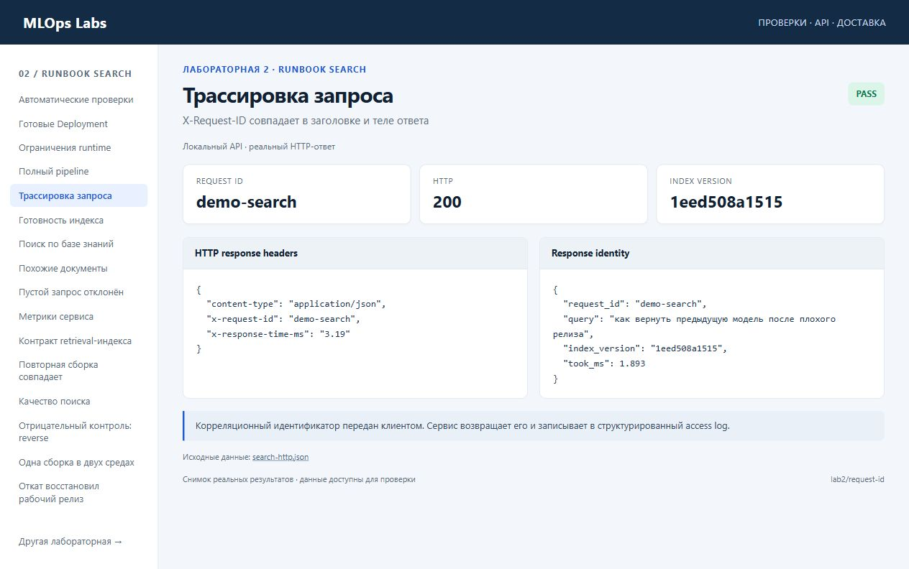

Корреляционный идентификатор передан клиентом. Сервис возвращает его и записывает в структурированный access log.

Источник: [search-http.json](../docs/media/sources/search-http.json).

### 6. Готовность индекса

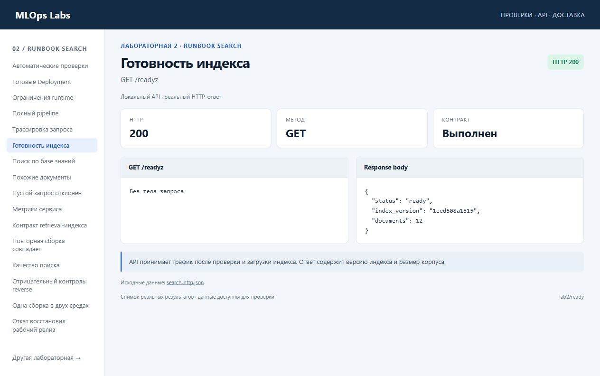

API принимает трафик после проверки и загрузки индекса. Ответ содержит версию индекса и размер корпуса.

Источник: [search-http.json](../docs/media/sources/search-http.json).

### 7. Поиск по базе знаний

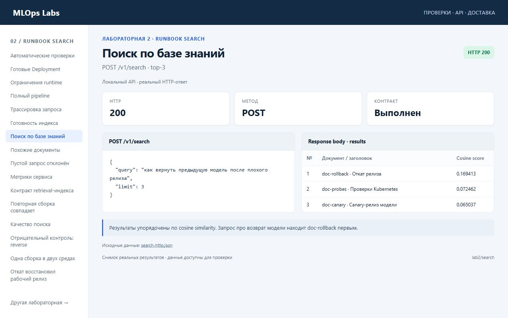

Результаты упорядочены по cosine similarity. Запрос про возврат модели находит doc-rollback первым.

Источник: [search-http.json](../docs/media/sources/search-http.json).

### 8. Похожие документы

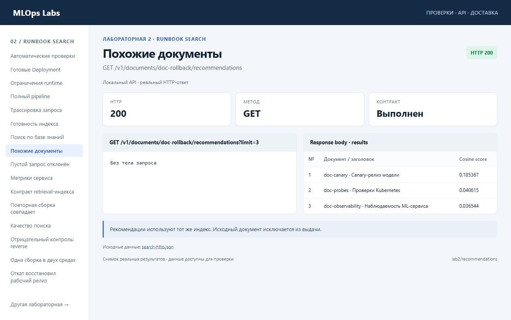

Рекомендации используют тот же индекс. Исходный документ исключается из выдачи.

Источник: [search-http.json](../docs/media/sources/search-http.json).

### 9. Пустой запрос отклонён

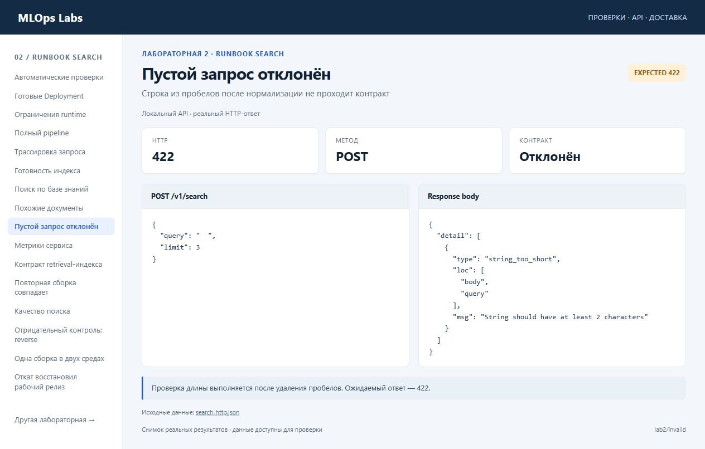

Проверка длины выполняется после удаления пробелов. Ожидаемый ответ — 422.

Источник: [search-http.json](../docs/media/sources/search-http.json).

### 10. Метрики сервиса

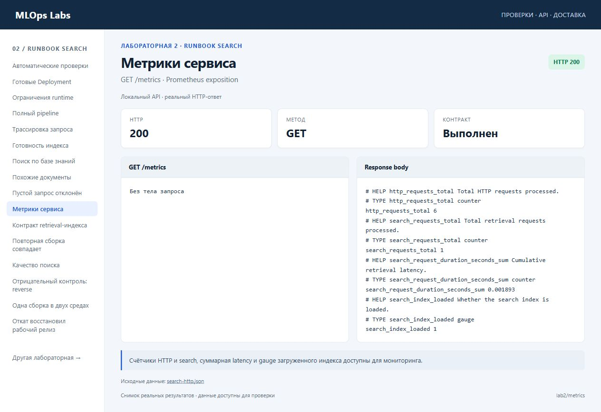

Счётчики HTTP и search, суммарная latency и gauge загруженного индекса доступны для мониторинга.

Источник: [search-http.json](../docs/media/sources/search-http.json).

### 11. Контракт retrieval-индекса

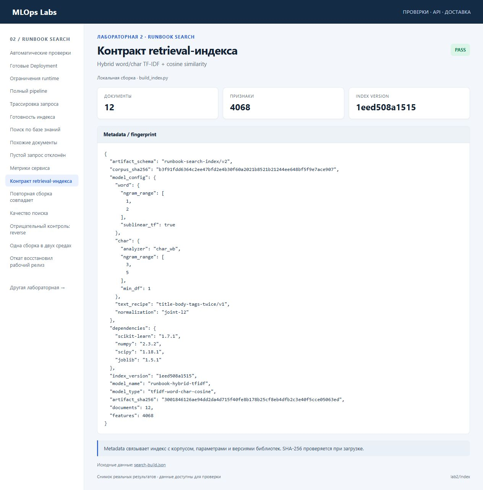

Metadata связывает индекс с корпусом, параметрами и версиями библиотек. SHA-256 проверяется при загрузке.

Источник: [search-build.json](../docs/media/sources/search-build.json).

### 12. Повторная сборка совпадает

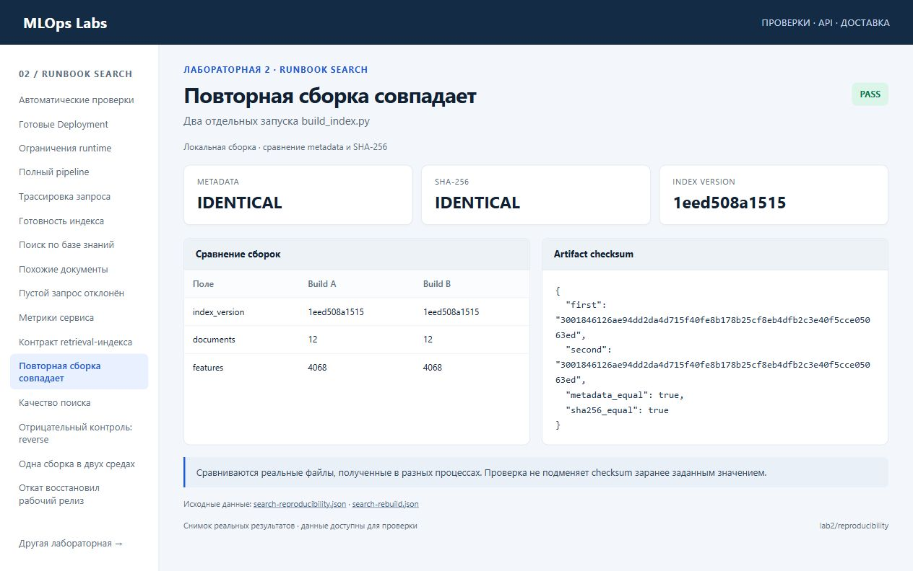

Сравниваются реальные файлы, полученные в разных процессах. Проверка не подменяет checksum заранее заданным значением.

Источник: [search-reproducibility.json](../docs/media/sources/search-reproducibility.json) · [search-rebuild.json](../docs/media/sources/search-rebuild.json).

### 13. Качество поиска

Порог MRR@3 ≥ 0.85, hit rate@3 ≥ 0.90. Macro recall@3 показан отдельно и не подменяет query hit rate.

Источник: [search-quality-normal.json](../docs/media/sources/search-quality-normal.json) · [search-quality.json](../docs/media/sources/search-quality.json).

### 14. Отрицательный контроль: reverse

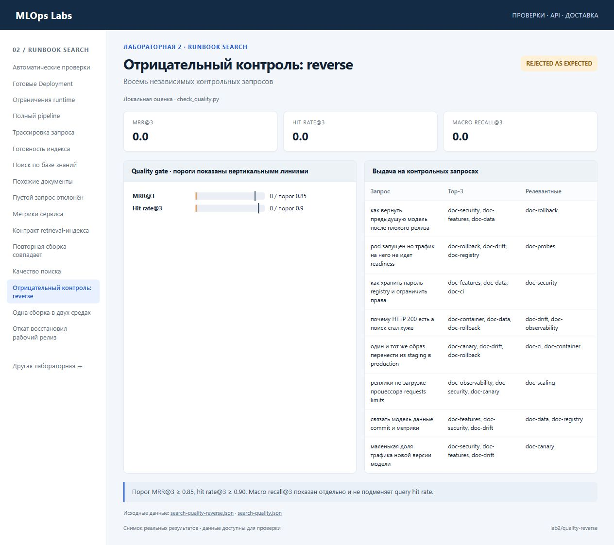

Порог MRR@3 ≥ 0.85, hit rate@3 ≥ 0.90. Macro recall@3 показан отдельно и не подменяет query hit rate.

Источник: [search-quality-reverse.json](../docs/media/sources/search-quality-reverse.json) · [search-quality.json](../docs/media/sources/search-quality.json).

### 15. Одна сборка в двух средах

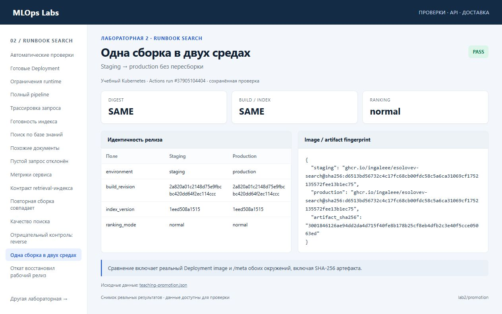

Сравнение включает реальный Deployment image и /meta обоих окружений, включая SHA-256 артефакта.

Источник: [teaching-promotion.json](../docs/media/sources/teaching-promotion.json).

### 16. Откат восстановил рабочий релиз

Readiness плохого кандидата была ready. Semantic smoke поймал деградацию и подтвердил возврат к прежним digest, build и index.

Источник: [teaching-rollback.json](../docs/media/sources/teaching-rollback.json).

## Происхождение файлов

[Манифест](../docs/media/manifest.json) перечисляет изображения и видео, их размеры, SHA-256 и источники. Порядок воспроизведения и обновления материалов описан в [инструкции](../docs/media/README.md).
