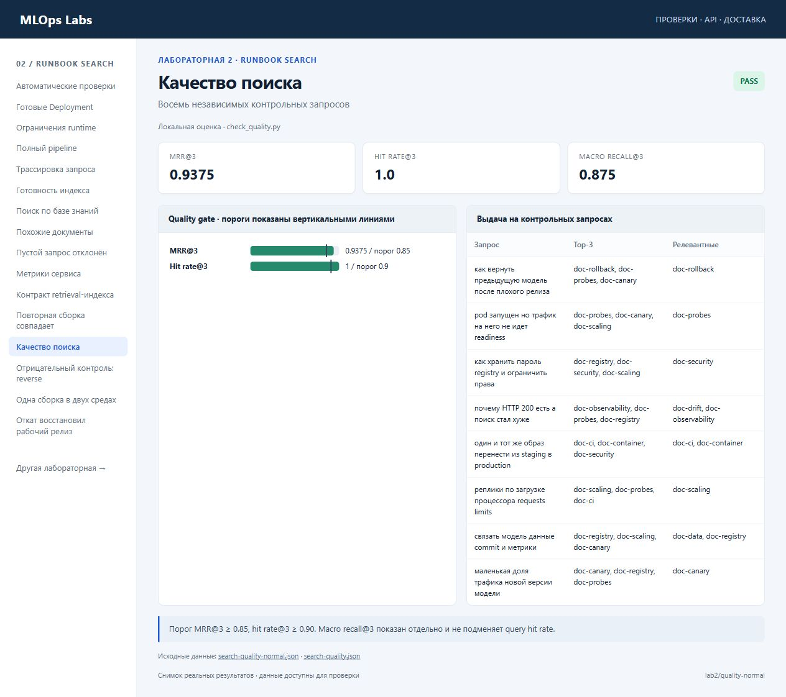
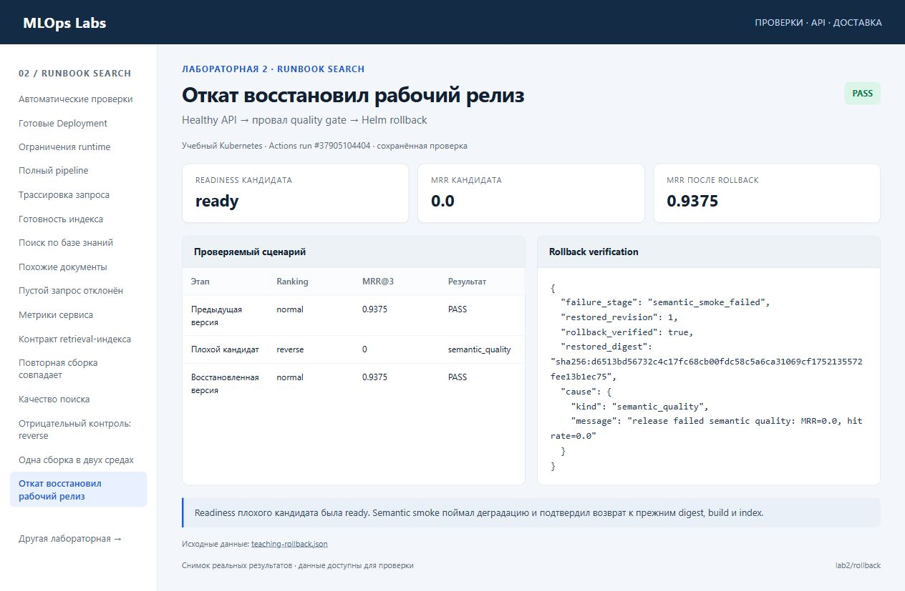
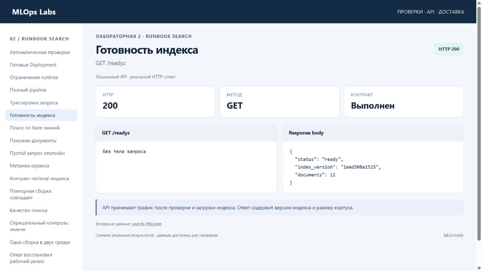
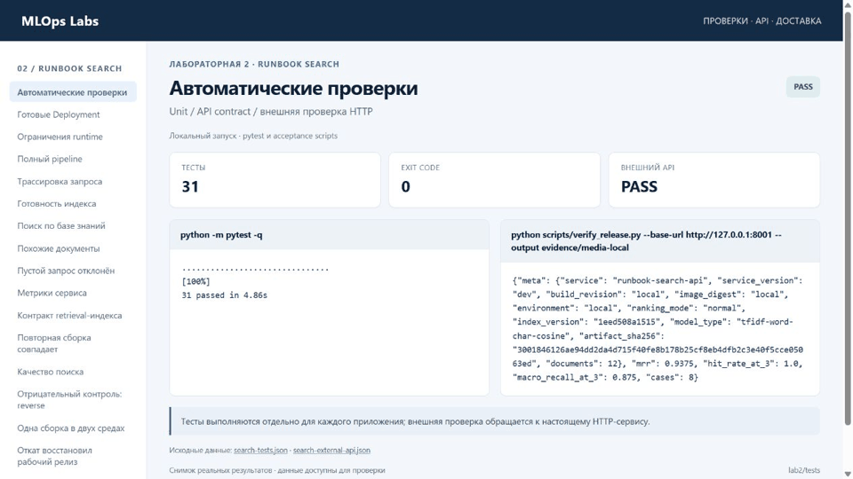

# Лабораторная 2 — Runbook Search

[Каталог проектов](../README.md) · [Окружение](../docs/development.md) · [CI/CD](../docs/delivery.md)

Сервис поиска по инженерной базе знаний. Retrieval-модель входит в контейнер, а выпуск в Kubernetes проходит проверки API и качества поиска. Одна сборка продвигается из staging в production; ухудшение ранжирования запускает rollback.

## Демонстрация

[Галерея скриншотов и видео](DEMO.md) показывает поиск, рекомендации, трассировку и метрики, воспроизводимость индекса, quality gate, совпадение staging/production и проверенный rollback. У снимков доступны исходные данные.

| Quality gate | Восстановление релиза |
|---|---|
| [](DEMO.md) | [](DEMO.md) |

<details>
<summary>Видеообзоры retrieval и выпуска</summary>

[](../docs/media/lab2/retrieval-demo.mp4)

[Retrieval: скачать MP4](../docs/media/lab2/retrieval-demo.mp4)

[](../docs/media/lab2/release-demo.mp4)

[Выпуск: скачать MP4](../docs/media/lab2/release-demo.mp4)

Снимки учебного стенда показывают сохранённый успешный запуск; в видеообзорах последовательно представлены его результаты.

</details>

## Архитектура

```text
documents.json → word/char TF-IDF → search-index.joblib + metadata.json
                                  ↓
                    Docker image → API → staging → production
                                         ↑           ↓
                                  quality gate    rollback
```

Word- и char-векторы объединяются и нормируются; документы ранжируются по cosine similarity с устойчивым разрешением ties. Версия индекса зависит от корпуса, параметров модели и библиотек. Загрузка проверяет metadata, SHA-256 артефакта, размерности и нормировку векторов. Повторная сборка должна давать одинаковые metadata и checksum.

Индекс создаётся из `data/documents.json`. Независимый `data/eval.json` используется только для оценки. Runtime загружает индекс из образа и не обращается к внешним ML API.

| Каталог или файл | Назначение |
|---|---|
| `app/` | API, retrieval engine и контракт индекса |
| `data/` | Корпус и контрольные запросы |
| `scripts/build_index.py` | Воспроизводимая сборка индекса |
| `scripts/check_quality.py` | Проверка normal и отрицательного reverse-кандидата |
| `scripts/verify_release.py` | Внешняя проверка API, качества и версии релиза |
| `scripts/deploy_release.sh` | Helm upgrade, проверки и восстановление релиза |
| `scripts/demonstrate_rollback.sh` | Проверка провала качества и точного отката |
| `helm/mlops-search/` | Chart, схема values и Helm test |

## Локальный запуск

Подготовьте [окружение](../docs/development.md), затем выполняйте команды из `lab2/`.

```bash
python scripts/build_index.py --output artifacts
python -m uvicorn app.main:app --host 127.0.0.1 --port 8001
```

Документация API: `http://127.0.0.1:8001/docs`. Порт отличается от Iris, поэтому оба сервиса можно запустить одновременно.

## API

| Метод | Endpoint | Назначение |
|---|---|---|
| POST | `/v1/search` | Поиск с результатами, score, latency и версией индекса |
| GET | `/v1/documents/{id}/recommendations` | Похожие документы без исходного документа |
| GET | `/livez` | Liveness процесса |
| GET | `/readyz` | Готовность загруженного индекса |
| GET | `/meta` | Build, digest, окружение и metadata модели |
| GET | `/metrics` | Метрики Prometheus |
| GET | `/docs` | OpenAPI UI |

`query` — строка длиной 2–500 символов, `limit` — целое число 1–10, по умолчанию 5. Пустые запросы, неверные limits и лишние поля возвращают 422. Ответ и HTTP-заголовок содержат одинаковый `X-Request-ID`; access logs записываются в JSON.

```bash
curl -s http://127.0.0.1:8001/v1/search \
  -H 'Content-Type: application/json' \
  -H 'X-Request-ID: search-example' \
  -d '{"query":"как вернуть предыдущую модель после плохого релиза","limit":3}'
```

Первый результат этого запроса — `doc-rollback`.

## Проверки

```bash
python scripts/build_index.py --output artifacts
python -m pytest -q
python scripts/check_quality.py
python scripts/check_chart.py
```

`check_quality.py` сохраняет отчёты normal/reverse и подтверждает, что reverse отклонён именно по качеству. `check_chart.py` требует установленный Helm и проверяет digest, схему values, probes, security context и ресурсы.

| Метрика | Порог | Подтверждённый результат |
|---|---|---|
| MRR@3 | ≥ 0.85 | 0.9375 |
| Recall@3 / query hit rate | ≥ 0.90 | 1.0 |
| Macro recall@3 | Диагностическая метрика | 0.875 |

`recall_at_3` в контракте задания означает долю запросов с релевантным документом в top-3. Отчёт отдельно содержит `hit_rate_at_3` и полноту по каждому запросу, усреднённую как `macro_recall_at_3`.

Подтверждены **31 тест**, восемь контрольных запросов в каждом окружении, совпадение релизов и rollback — [отчёт](../docs/validation.md#runbook-search).

## Docker

```bash
docker compose -p mlops-search up -d --build search
python scripts/smoke_local.py
python scripts/verify_release.py --base-url http://127.0.0.1:18080 --output evidence/local
docker compose -p mlops-search down
```

Compose публикует API на `127.0.0.1:18080`. Multi-stage Dockerfile выполняет сборку индекса, тесты и quality gate, затем переносит проверенный артефакт в runtime. Runtime работает как UID/GID 10001; Compose включает read-only filesystem и ограничения привилегий.

## Kubernetes

Релизы `esolovev-search-staging` и `esolovev-search-prod` размещаются в `mlops-students`. Helm принимает только `repository@sha256:<64 hex>`; неполный digest и repository с mutable tag отклоняются до деплоя. Service имеет тип ClusterIP.

Внешняя проверка существующего staging:

```bash
python scripts/verify_release.py --release esolovev-search-staging \
  --expected-environment staging --output evidence/staging
```

Для проверки идентичности добавьте `--expected-digest`, `--expected-build-revision` и `--expected-index` из проверяемого релиза. Настройка доступа, параметры workflow и порядок promotion описаны в [CI/CD](../docs/delivery.md).

## Promotion и rollback

Staging проходит Helm test и внешний semantic smoke. После подтверждения production получает тот же digest без пересборки. Pipeline сравнивает Deployment image и `/meta` двух окружений.

Отрицательный сценарий выпускает `rankingMode=reverse`: probes остаются healthy, но качество поиска падает. Pipeline сохраняет последнюю хорошую revision, выполняет `helm rollback` и проверяет восстановление прежних digest, build revision и index version. Затем normal-версия проходит итоговый promotion. История Helm сохраняется.

Readiness проверяет загрузку индекса и доступность процесса. Корректность ранжирования подтверждает semantic smoke по контрольным запросам; поэтому эти две проверки выполняются отдельно.

## Конфигурация

| Переменная | Значение по умолчанию | Назначение |
|---|---|---|
| `ARTIFACT_DIR` | `artifacts` | Каталог доверенного индекса |
| `RANKING_MODE` | `normal` | Ранжирование; `reverse` для отрицательного контроля |
| `ENVIRONMENT` | `local` | Окружение в `/meta` |
| `BUILD_REVISION` | `local` | Версия исходного кода в `/meta` |
| `IMAGE_DIGEST` | `local` | Digest в `/meta`, задаётся при деплое |
| `APP_VERSION` | `dev` | Версия API в `/meta` |
| `SERVICE_NAME` | `runbook-search-api` | Имя сервиса и логгера |
| `LOG_LEVEL` | `INFO` | Уровень логирования |

Артефакт joblib доверенный и создаётся внутри сборки. SHA-256 обнаруживает повреждение; для десериализации требуется доверенный источник артефакта.

Исходные требования сохранены в [ASSIGNMENT.md](ASSIGNMENT.md).
